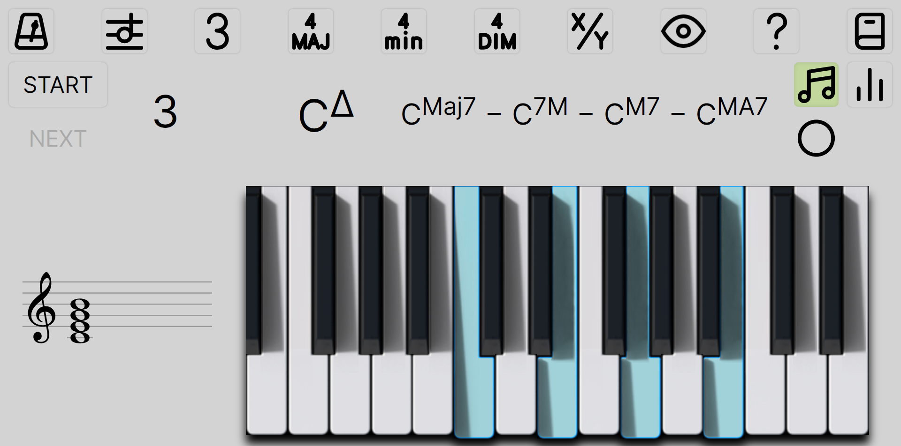

# Chord quiz

Cross-platform app to learn chords with MIDI input. [Demo](https://chord-quiz.netlify.app)



This is a one-month internship project. Original idea from François Faisant. Code by Kamil Szczerba. With Emmanuel Chailloux and Loïc Sylvestre's supervision.

## Setting up the environment

You need [Node.js](https://nodejs.org/en/download/current/) installed.

```bash
git clone https://github.com/klavinski/chord-quiz
cd chord-quiz
npm install
```

## Running the development server

```bash
npm run dev
```

You can then visit `localhost:1234` to view the app in your browser.

## Building the app

```bash
npm run build
```

The static files for the web app are available in the `dist` folder.

You may then run a platform-specific command depending on the one you target.

* Android: `npx cap open android`
* iOS: untested. It should be straightforward as it is a supported platform by the cross-platform library. [Directions here](https://capacitorjs.com/docs/ios).
* Windows/Mac/Linux: the app will be located in the `electron/dist` folder after running the following commands:

```bash
npx cap sync @capacitor-community/electron
cd electron
npm run electron:pack
```