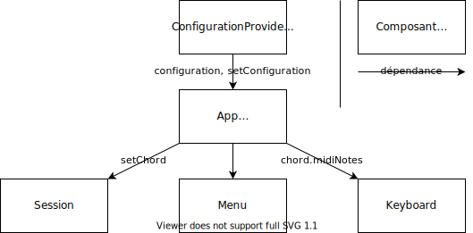
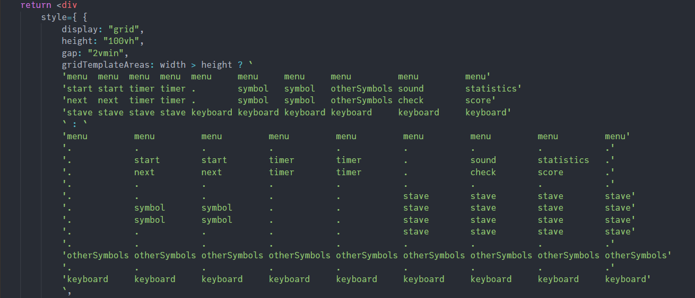

# Questions de conception et choix technologiques

Ce document présente les différentes questions soulevées durant le stage.

## Choix de la technologie multi-plateformes

J'ai de l'expérience en technologies du web, ce qui me dirige vers JavaScript/TypeScript. La technologie web multi-plateformes du début de la décennie était [Cordova](https://cordova.apache.org/), qui crée une vue du navigateur sans bord sur chaque plateforme. Elle est depuis remplacée par [Capacitor](https://capacitorjs.com/).

[React Native](https://reactnative.dev) attira aussi mon attention. Au lieu d'utiliser une vue web, il affiche des composants d'interface (texte, image, etc.) propres à chaque plateforme. Cela permet d'avoir de meilleures performances et une apparence native (par exemple, les boutons ressemblent à l'interface de la plateforme).

React Native était mon premier choix. Cependant :

* L'API de React Native expose le dénominateur commun aux plateformes. Par exemple, si iOS propose un fond transparent à l'interface, mais pas Android, alors React Native ne le propose pas non plus, au lieu de réimplementer la fonctionnalité sur Android. En conséquence, les possibilités de configuration sont limitées et je devrais réimplémenter des nombreuses fonctionnalités (comme le placement relatif des composants).
* Aucune bibliothèque MIDI pour React Native sur GitHub n'est codée pour toutes les plateformes. Il faudrait donc l'écrire moi-même. Ne maîtrisant pas les API propres à chaque plateforme en plus des langages requis, cela demanderait plus que la durée du stage.

Je décidai donc d'utiliser Capacitor.

* Capacitor est beaucoup moins populaire que React Native. Chercher des solutions sur Internet est compliqué. L'unique voie fructueuse était de lire les _issues_ sur GitHub pour diriger l'exploration.
* Il y eut une difficulté majeure : MIDI. [Seuls certains navigateurs](https://caniuse.com/midi) implémentent nativement MIDI. [Il n'y a pas de bibliothèque MIDI pour Capacitor](https://github.com/capacitor-community/proposals/issues/24). Capacitor propose une rétro-compatibilité mitigée avec les plugins Cordova, mais l'[unique plugin MIDI pour Cordova](https://github.com/josiaho/cordova-plugin-midi-sender) ne fonctionna pas lors de mes tests sur Android.

Je me suis donc limité aux plateformes implémentant Web MIDI.

## Architecture

Dans le passé, j'avais déjà programmé une application composée essentiellement d'interface et le défi principal était la complexité cognitive. Où doit résider l'état de l'application ? Qui peut le changer ? Etc.

Comme l'application est relativement simple, j'ai opté pour une approche unidirectionnelle des données. Il existe un objet `configuration`, qui ne contient que des données (pas de méthodes), accessible en lecture et écriture de tout composant. Chaque composant peut avoir des dépendances, et est recalculé si l'une des dépendances change.

Voici un extrait de l'arbre des composants. S'il était plus profond, il pourrait il y avoir un problème de performances à cause de la quantité à recalculer.

Il y a quelques états locaux lorsqu'ils ne sont pas nécessaires en dehors du composant (par exemple, `Session` gère son chronomètre seul).

## Représentation en mémoire et génération de l'accord

Un accord possède plusieurs représentations : ses caractéristiques (comme tonique : C, octave, 4, type : majeur), sa notation (comme C4), ses notes MIDI (comme 60, 64, 67). La génération de l'accord doit partir d'une de ces représentations et déduire les autres notations. Comme la configuration sélectionnée par l'utilisateur donne ces caractéristiques, je pars de celles-ci. Générer le reste est alors plus facile que de partir des notes MIDI et calculer les caractéristiques.

Pour l'inversion, je calculais la racine et l'indiquais à la bibliothèque musicale `tonal`. Mais `tonal` n'arrive pas à inverser les accords sur plus d'une octave, comme add9. Je convertissais alors en notes MIDI et décalais les nombres. Le résultat était valide, mais pas celui attendu : l'on perdait la spécificité dièse/bémol (par exemple, C# et Db sont la même note MIDI). J'ai donc conservé aussi les notes sous format textuel pour afficher correctement les enharmoniques sur la portée. Voici par exemple C# avant et après correction :

## Rétrospective

Au début du stage, j'avais prédit qu'en l'absence d'obstacle, le développement durerait une semaine. Il s'est étendu sur le mois. Le temps fut principalement consacré à :

* Explorer des technologies et bibliothèques, tenter de les faire fonctionner.
* Traduire l'interface graphique en code React.
* Ajuster le positionnement et l'apparence de tous les composants graphiques.

Ce sont des activités simples mais laborieuses. La part liée à l'algorithmique ou l'architecture, où se manifeste la pertinence culturelle et intellectuelle du développeur, est minime. Je tire les leçons suivantes :

* Il vaut mieux sélectionner des technologies et bibliothèques populaires, quitte à devoir implémenter ou concéder certaines fonctionnalités. Autrement, il y a un grand risque de devoir déboguer du code inconnu sans aide, et sans savoir si cela sera ultimement fructueux.
* Il faut éviter autant que possible les traductions (interface graphique vers code React, représentation d'accord vers notes MIDI...) car la traduction prend du temps et l'on peut perdre de l'information.
* Utiliser pleinement une vue web plutôt qu'une interface native était un excellent choix. La fonctionnalité CSS grid permet le positionnement nominal et visuel, alors que React Native aurait requis de préciser la position et taille des composants en pixels. Voici un exemple de CSS grid :

